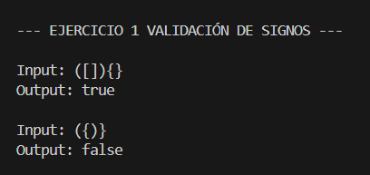
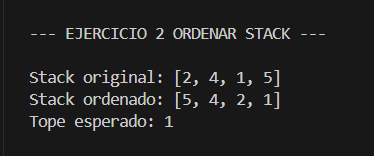
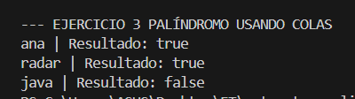

# Práctica 3: Ejercicios de Lógica con Pilas y Colas

**Nombre:** Elvis Tipanta  
**Asignatura:** Estructura de Datos - Segundo Interciclo  

---

## 📌 Descripción General

Este proyecto implementa soluciones en Java para resolver problemas lógicos utilizando estructuras de datos lineales (Pilas y Colas). Se aplican estrictamente los principios LIFO y FIFO mediante el uso de `Stack` y `Queue`, respetando la restricción de no utilizar arreglos ni listas para el ordenamiento o validación directa.

---

## 🛠️ Explicación de los Ejercicios

### Ejercicio 01: Validación de Signos
Utiliza un `Stack` para asegurar que los caracteres `()`, `{}`, `[]` se abran y cierren en el orden correcto. Los símbolos de apertura se apilan, y al encontrar uno de cierre, se desapila el último elemento para verificar que coincidan.

### Ejercicio 02: Ordenar un Stack
Ordena una pila dejando el elemento menor en el tope. La lógica utiliza exclusivamente un `Stack` auxiliar y una variable temporal, trasladando los elementos mayores a la pila auxiliar temporalmente para encontrar la posición correcta de cada número.

### Ejercicio 03: Palíndromo usando Colas
Verifica si una palabra se lee igual en ambas direcciones. Introduce los caracteres de la palabra simultáneamente en un `Stack` (comportamiento LIFO) y en un `Queue` (comportamiento FIFO), para luego extraerlos y compararlos uno a uno sin usar métodos de inversión de Strings.

---

## 💻 Evidencias de Ejecución

### Ejercicio 01: Validación de signos
* **Código:** 

        for (int i = 0; i < s.length(); i++) {
            char actual = s.charAt(i);
            if (actual == '(' || actual == '[' || actual == '{') {
                pila.push(actual);
            }
            else if (actual == ')' || actual == ']' || actual == '}') {
                if (pila.isEmpty()) {
                    return false;
                }
                char tope = pila.pop();
                if (actual == ')' && tope != '(') {
                    return false;
                }
                if (actual == ']' && tope != '[') {
                    return false;
                }
                if (actual == '}' && tope != '{') {
                    return false;
                }
            }   
        }
        return pila.isEmpty();

* **Consola:** 

### Ejercicio 02: Ordenar Stack
* **Código:** 

        while (!stack.isEmpty()) {
            int temp = stack.pop();
            while (!pila.isEmpty() && pila.peek() > temp) {
                stack.push(pila.pop());
            }
            pila.push(temp);
        }
        while (!pila.isEmpty()) {
            stack.push(pila.pop());
        }

* **Consola:** 

### Ejercicio 03: Palíndromo usando Colas
* **Código:** 

        while (!cola.isEmpty()) {
            char letraCola = cola.remove();
            char letraPila = pila.pop();
            if (letraCola != letraPila) {
                return false;
            }
        }
        return true;
  
* **Consola:** 

---

## 🧠 Conclusiones

1. Sobre el principio LIFO (Pilas): El uso de la estructura Stack y su principio LIFO (Último en entrar, Primero en salir) resulta ideal para resolver problemas que requieren "recordar" el último estado de una secuencia. Esto quedó demostrado en el Ejercicio 01, donde la pila permitió emparejar y validar correctamente los signos de apertura y cierre en el orden exacto en que debían resolverse.

2. Sobre la combinación de estructuras (Pilas y Colas): Combinar una Cola (Queue) con una Pila (Stack) es una estrategia altamente eficiente para analizar datos desde extremos opuestos simultáneamente. Mientras la cola respeta y mantiene el orden original de entrada (FIFO), la pila lo invierte de forma natural, lo que facilitó la validación del palíndromo en el Ejercicio 03 sin necesidad de usar métodos externos o transformar cadenas de texto.

3. Sobre las restricciones y la lógica algorítmica: Restringir el uso de arreglos o listas para manipular datos obliga a desarrollar un pensamiento algorítmico mucho más profundo. En el Ejercicio 02, quedó en evidencia que utilizando únicamente una pila auxiliar y las operaciones nativas básicas (push, pop, peek, isEmpty), es completamente posible ordenar conjuntos de datos gestionando adecuadamente el almacenamiento temporal.

---

## 🔗 Enlace al Repositorio

* **URL** 
https://github.com/Kochito-07/estructuras_lineales_pilas_colas_ET.git

---

## 🚀 Entorno de Desarrollo (VS Code)

El proyecto está estructurado de la siguiente manera:
* `src`: Carpeta principal del código.
* `app`: Carpeta main para la ejecución.
* `utils`: Codigos implementados para la ejecución.
